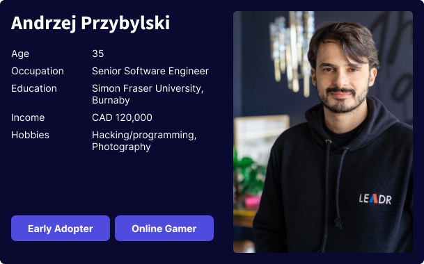
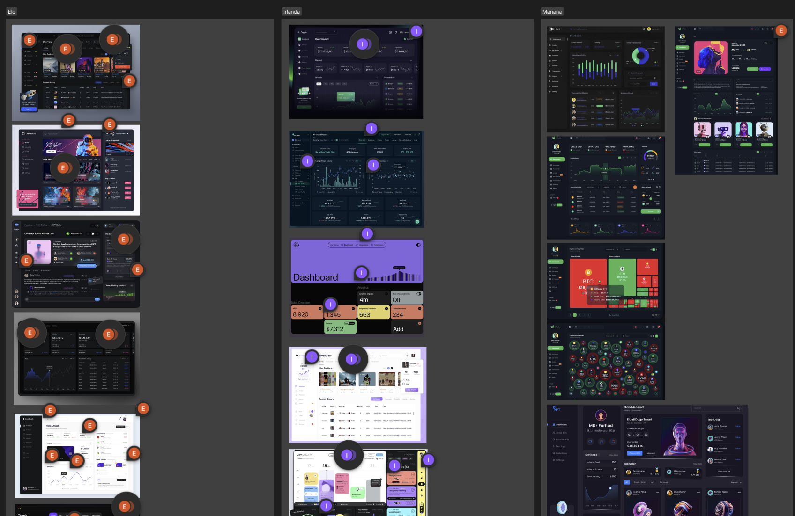
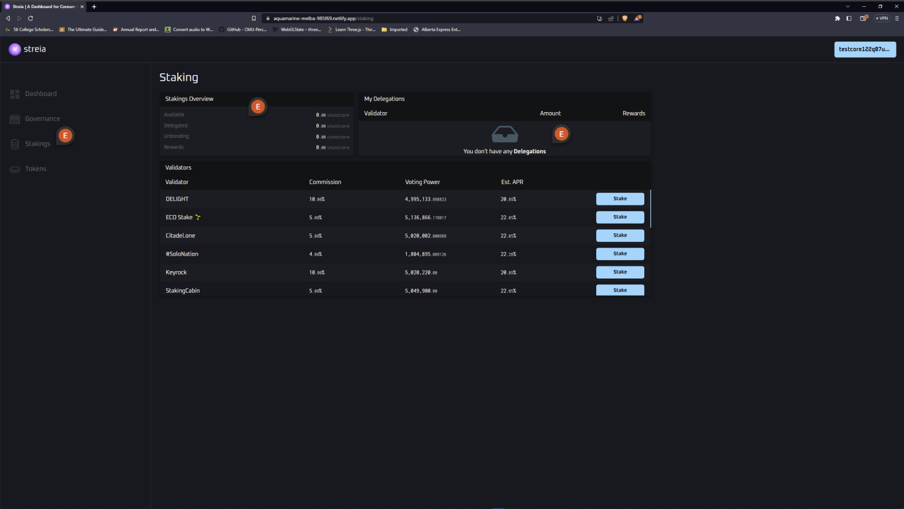

# Resolute Labs - BlockChain Dashboard
This project was developed for Resolute Labs. Resolute labs is a startup that An ecosystem that develops tools and dApps to live on top of the Coreum Blockchain, and gives it's users easy access to communicate and use the said Blockchain. Our role as designers on the project was to design a dashboard for Resolute Labs's new service(nft) of the business

## Challenges
The main challenge was to design a dashboard that would be easy to use and understand for the users. The dashboard had to be simple and easy to use, but also had to be able to show all the information that the user needed to see. It had to incorporate the different services that Resolute Labs offers its users on the coreum blockchain such as making tokens, delegation (staking), governance,.... etc. There was a lot of information to present to the users' and we had to find a way to present it in a way that would not be overwhelming or seen as cluttered. Also, the topic of blockchain is a very complex one and we had to find a way to make it easy to understand for the users. When needed to first understand the topic ourselves before we could begin our design process.

## Process
We set out to first understand the topic of blockchain and how it works. We did this by doing research on the topic and also by talking to the client and asking him more questions about the topic. We then set out to understand the users and their needs. We did this by creating a user persona and a user journey map. We then set out to create a site map and a user flow. We then created wireframes and prototypes. We then tested the prototypes with users and made changes to the design based on the feedback we got from the users. We then created a high fidelity prototype and presented it to the client.

## User Persona

## Inspiration
As a team we assembled 30 (10 per individual) different dashboards,NFT and Crypto pojects and analyzed them. We then created a mood board of the dashboards that we liked and that we thought would be a good inspiration for our design. We then created a style guide based on the mood board.

## Site Map
We already had a site map from the minimum viable product Resolute Labs showed our team on the first design breif. We made some changes to the site map based on the new information that we got from the client like adding more pages/routes to the navigation menu and so forth.

## Design Process
We followed the atomic design process. We started by creating the atoms, then the molecules, then the organisms, then the templates and finally the pages. We started by creating the atoms. We created the atoms by creating a style guide. We picked out replacement colors, fonts because the initial selections the client wanted to use did not look great.  We then created the molecules. We created the molecules by creating the different components that we would need for the dashboard. We then created the organisms. We created the organisms by creating the different sections that we would need for the dashboard. We then created the templates. We created the templates by creating the different pages that we would need for the dashboard. We then created the pages. We created the pages by creating the different pages that we would need for the dashboard.